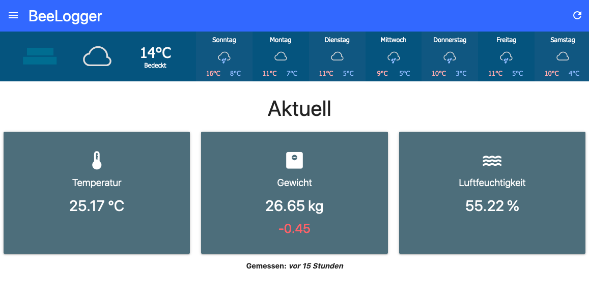
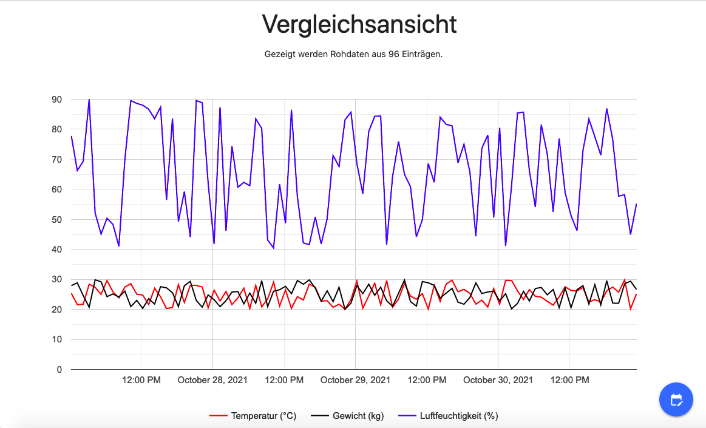
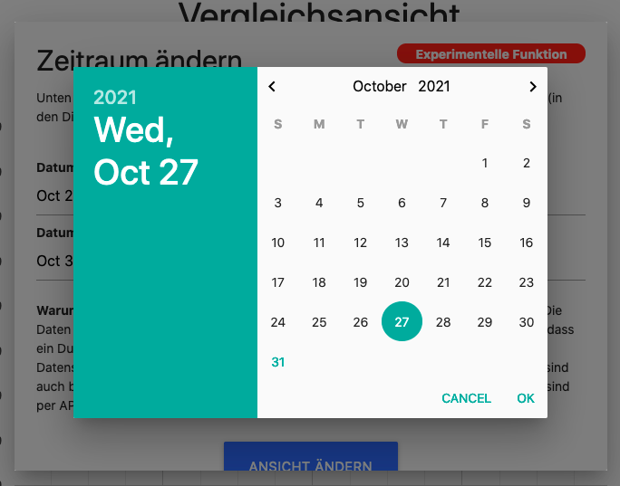
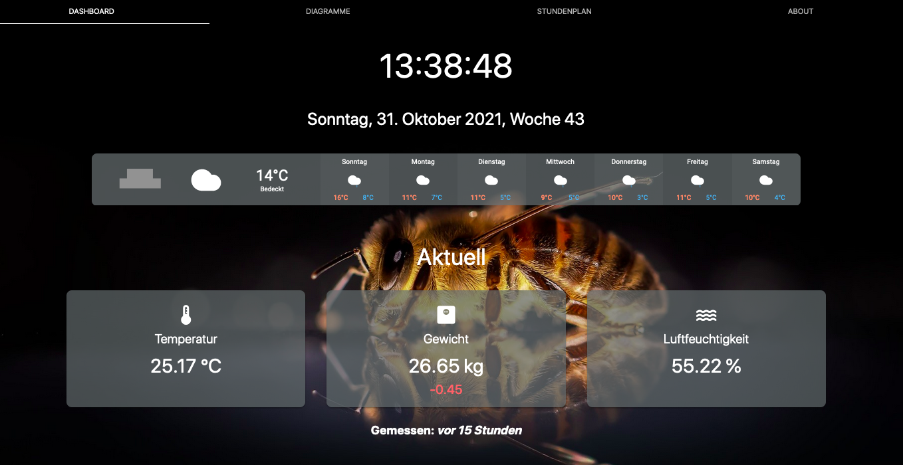

<h1>BeeLogger</h1>

  

🐝 A software for beekeepers that provides scripts for recording data (such as weight or temperature), a powerful REST API for processing it and a dashboard for viewing it. 

 

---

## Features
### Web Dashboard
BeeLogger provides a clean web dashboard to view the collected data in a variety of charts and figures.
> The data in the screenshots is made up and far from realistic.
#### Current data sections
See current/recent data at first glance.

#### Example chart
There are many different kinds of charts. This is just an example.

#### Custom date picking
Show data for any date range you like using our custom date pickers.

### Display Software
At our school, which is also the origin of this project, we have a touch screen showing some of the collected data in a touchscreen-friendly design. The whole thing is a bit more customizable than the web dashboard and has some other features for students (like timetables). It also provides a (private) gallery of photos that are related to our bee colonies at school.
> The data in the screenshots is made up and far from realistic.

### Optional Chrome Extension
> Source code and short README here: [`chrome-domain-lock/`](chrome-domain-lock/)

If you want to secure the kiosk so that it stays on the BeeLogger page, just use the basic plugin for Chrome.
Open the background.js file and customize your kiosk URL. Then open the extension-manager and enable developer mode. Then select "load unpacked extension" and open the "Chrome Domain lock" folder, and off you go.

Note that this plugin makes the browser otherwise unusable since it forces to only have a single tab with the set website. It may also be difficult to remove the extension.test

 

## 📦 Installing / Deploying BeeLogger
A full guide to both a [&rarr; Docker (& Docker Compose)](https://github.com/Programmier-AG/BeeLogger/wiki/Deployment-using-Docker) and a [&rarr; non-Docker](https://github.com/Programmier-AG/BeeLogger/wiki/Deployment-using-Apache-WSGI) deployment is available on the corresponding [wiki](https://github.com/Programmier-AG/BeeLogger/wiki) pages.

 

---

## Third party dependencies
### Front-End
* [Materialize](https://materializecss.com/)
* [Material Icons](https://fonts.google.com/icons)
* [Google Charts](https://developers.google.com/chart)
* [amCharts weather icons](https://www.amcharts.com/free-animated-svg-weather-icons/) ([License](https://creativecommons.org/licenses/by/4.0/) CC BY 4.0; file names changed)

### Docker
* [wait-for-it](https://github.com/vishnubob/wait-for-it) ([License](https://github.com/vishnubob/wait-for-it/blob/master/LICENSE) MIT)

---

**Copyright (c) 2018-2021 Fabian Reinders, Sönke Klock**